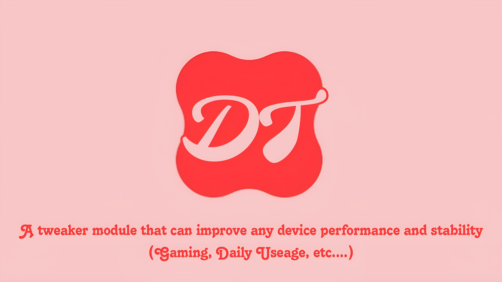

# DT - Device Tweaker

  
**A tweaker module that can improve any device smoothness and stability**

**Working on all devices**

 

# v1.0.0 Released

### Features:
- Improves audio and video recording quality
- Better call voice quality
- Faster boot time
- Better Responsiveness & Speed
- Zygote preforking
- FPS Stabilizer
- Audio Improvements
- Disables sending of usage data
- Makes apps load faster and frees more ram.
- Increase jpg quality to 100%
- Dalvik Virtual Machine tweaks
- Make Phone Ring as soon as you get a Call
- Save Battery Without Performance Drop
- Change Default Rendering Driver 
- Disables blackscreen issue after a 
- Better RAM Management
- Disable Hungry GMS
- Aggressive Ram Killer (Prop)
- Stop Send Logs

### Usage:
- Install it as a normal module via Magisk or KSU or APatch

### Credits:
<a href="https://t.me/mrx7014cloud">**MRX7014 Cloud**</a>
